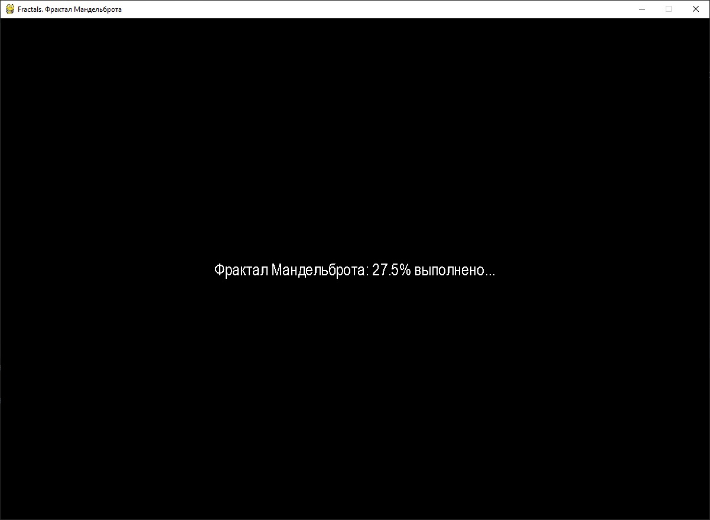
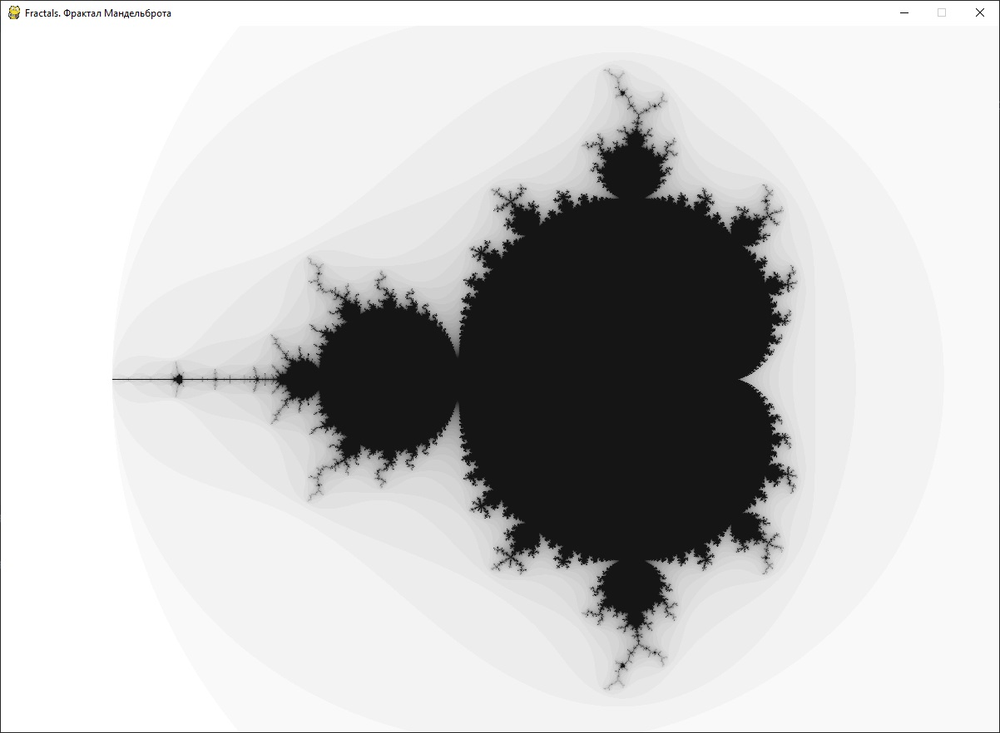
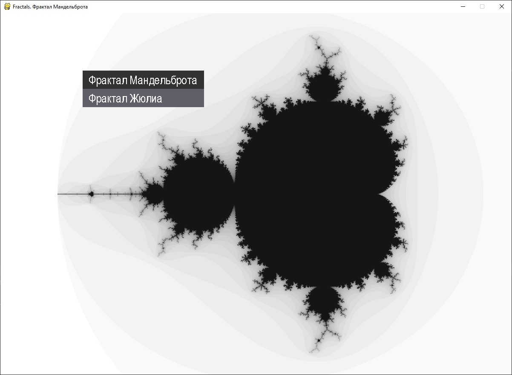
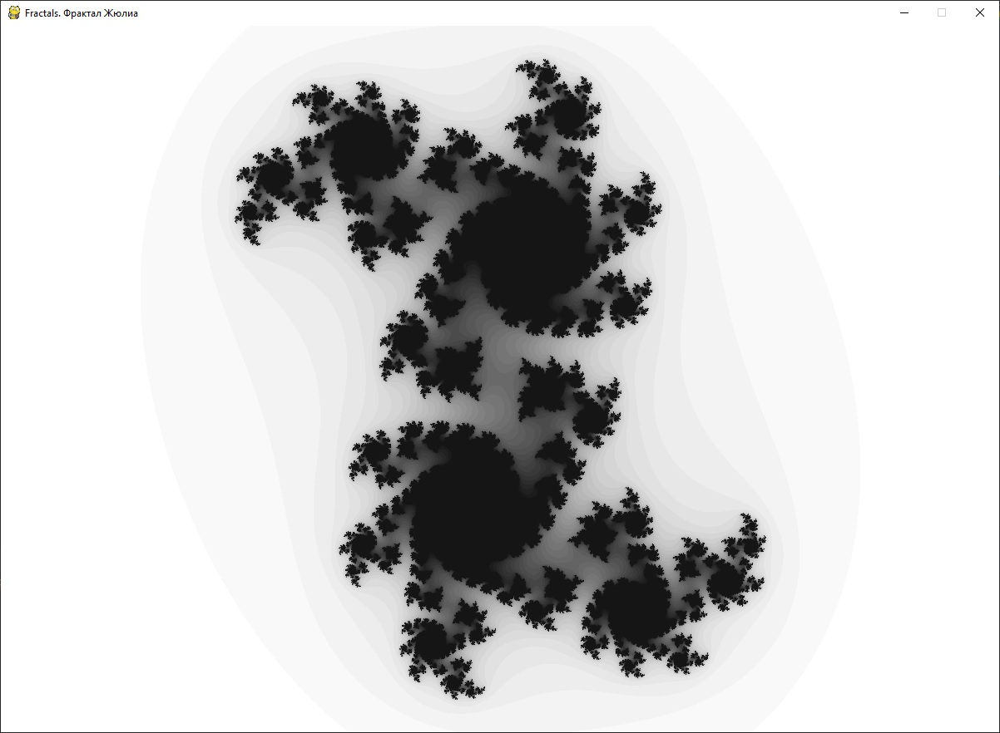
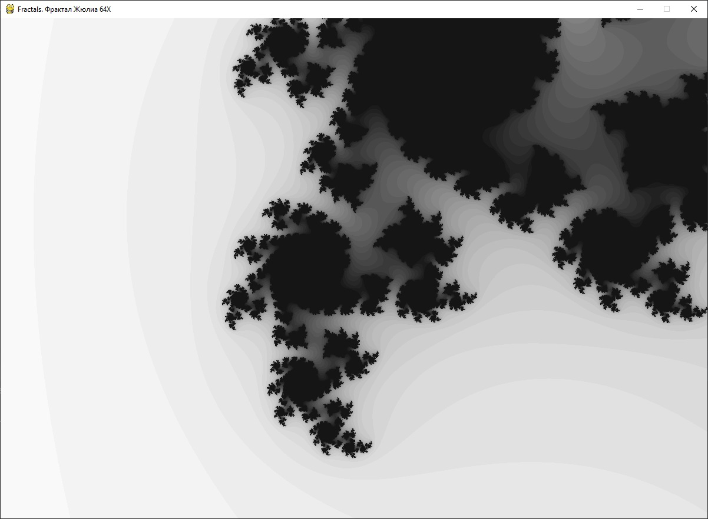
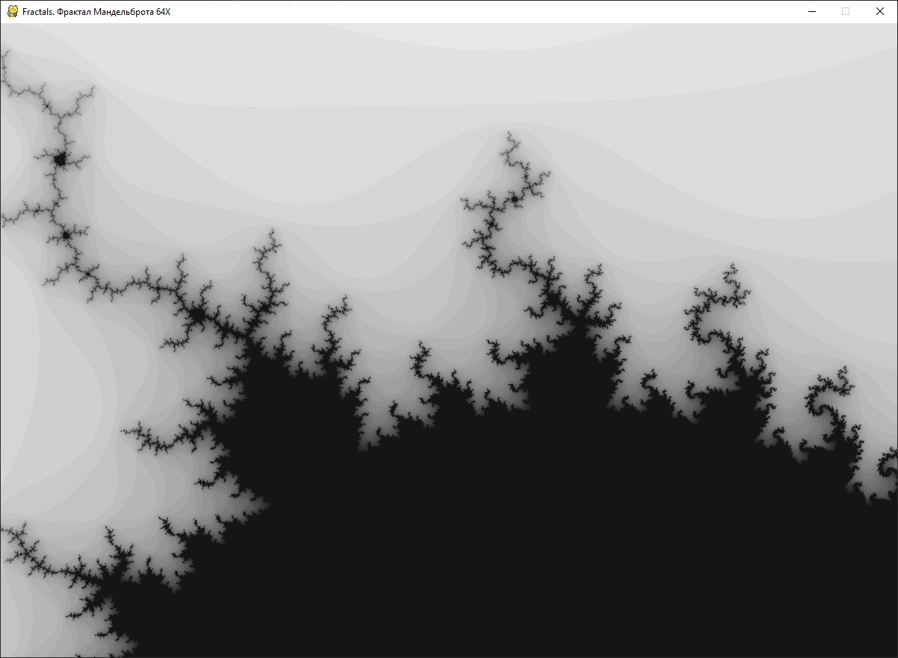

# Fractals
Программа для демонстрации фракталов Мандельброта и Жюлиа

Простой скрипт, выводящий на экран фракталы Мандельброта и Жюлиа. Для работы используется библиотека pygame. Сделано простое контекстное меню для выбора фрактала для отображения. Картинку можно приближать и отдалять с помощью колесика мышки. Так как построение фрактала - процесс довольно длительный, то чтобы не происходило зависания на время работы функции построения, сама функция вполнена в виде генератора, возвращающего или картинку с процентом выполнения или (когда процесс завершен) отрендеренный фрактал.

